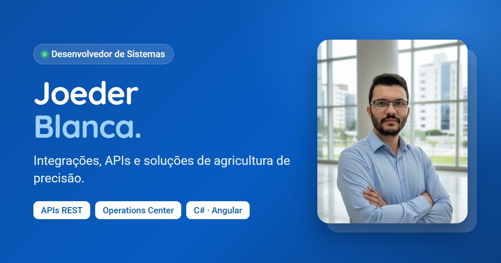

<p align="center">
  
</p>

<h1 align="center">Portfólio Joeder Blanca</h1>

<p align="center">
  Site pessoal e painel administrativo de <strong>Joeder Blanca</strong>, desenvolvedor de sistemas
  especializado em integrações, APIs e soluções de agricultura de precisão.
</p>

<p align="center">
  
  
  
  
  
</p>

---

## Sobre o projeto

Portfólio profissional com apresentação, habilidades, carreira, cursos, blog, projetos e
contato. Todo o conteúdo fica num banco MySQL e é editado por um painel administrativo
próprio, sem precisar mexer no código.

### Destaques

- **Conteúdo 100% gerenciável:** textos, fotos, habilidades, experiências, formação, cursos,
  contatos, redes sociais, posts e projetos são editados pelo painel.
- **Painel administrativo completo:** login, CRUD de todas as seções, editor de texto rico
  para o blog, upload de imagens, validação por campo e layout responsivo.
- **SEO pensado para busca e compartilhamento:** meta tags, Open Graph e Twitter Card gerados
  no servidor a partir do banco, dados estruturados (`ProfilePage`, `Person`, `BlogPosting`),
  `sitemap.xml` e `robots.txt` dinâmicos, e preview próprio para cada post compartilhado.
- **Design responsivo:** layout pensado para desktop, tablet e celular, com animações leves e
  suporte a `prefers-reduced-motion`.
- **Backend leve:** Flask + PyMySQL, sem ORM, com apenas cinco dependências.
- **Segurança:** consultas parametrizadas, whitelist de colunas, escape e sanitização de todo
  conteúdo renderizado, senhas com hash, tokens assinados com expiração e verificação do tipo
  real dos arquivos enviados.

## Stack

| Camada | Tecnologias |
|---|---|
| Frontend | HTML5, CSS3, JavaScript, Bootstrap 5, AOS, Isotope, Typed.js, Quill |
| Backend | Python 3, Flask, PyMySQL, itsdangerous |
| Banco de dados | MySQL 8 (`utf8mb4`) |

## Arquitetura

```
┌────────────────────┐        ┌──────────────────────────┐        ┌───────────┐
│  Navegador         │  HTTP  │  Backend Flask           │  SQL   │  MySQL 8  │
│  ├ index.html      │ ─────► │  ├ /api/*       (JSON)   │ ─────► │           │
│  ├ service-details │        │  ├ /uploads/*   (imagens)│        └───────────┘
│  └ admin.html      │ ◄───── │  ├ /sitemap.xml, robots  │
└────────────────────┘        │  └ frontend/ + meta SEO  │
                              └──────────────────────────┘
```

O backend também serve o frontend. Ao entregar as páginas públicas, ele injeta no `<head>`
as meta tags montadas com os dados do banco, para que buscadores e redes sociais leiam o
conteúdo certo mesmo sem executar JavaScript.

## Estrutura

```
portfolio/
├── frontend/
│   ├── index.html              Página inicial
│   ├── service-details.html    Página de post do blog (?post=ID)
│   ├── admin.html              Painel administrativo
│   ├── site.webmanifest
│   └── assets/
│       ├── css/                main.css (site) e admin.css (painel)
│       ├── js/
│       │   ├── config.js       Endereço da API
│       │   ├── common.js       Helpers compartilhados (API, escape, URLs)
│       │   ├── site.js         Renderização da página inicial
│       │   ├── admin.js        Telas do painel
│       │   └── main.js         Interações do layout
│       ├── img/
│       └── vendor/
└── backend/
    ├── app.py                  Aplicação Flask e rotas estáticas
    ├── config.py               Configuração via .env
    ├── db.py                   Conexão com o MySQL
    ├── resources.py            Tabelas editáveis e validação
    ├── api_public.py           Endpoints do site
    ├── api_admin.py            Endpoints do painel
    ├── auth.py                 Login e tokens
    ├── seo.py                  Meta tags, JSON-LD, sitemap e robots
    ├── manage.py               Comandos de administração
    ├── requirements.txt
    ├── .env.example
    └── database/
        ├── script.sql          Criação do banco com o conteúdo inicial
        └── dados_migracao.sql  Posts e projetos importados
```

## Como rodar localmente

**Pré-requisitos:** Python 3.10+ e MySQL 8.

**1. Banco de dados:** execute os scripts no MySQL, nesta ordem:

```bash
mysql -u root -p < backend/database/script.sql
mysql -u root -p < backend/database/dados_migracao.sql
```

> O `script.sql` recria as tabelas do zero. Executá-lo novamente apaga os dados existentes.

**2. Ambiente Python**

```bash
cd backend
python -m venv .venv
.venv\Scripts\activate          # Linux/macOS: source .venv/bin/activate
pip install -r requirements.txt
copy .env.example .env           # Linux/macOS: cp .env.example .env
```

Preencha o `.env` com as credenciais do MySQL e uma `SECRET_KEY`:

```bash
python -c "import secrets; print(secrets.token_hex(32))"
```

**3. Usuário do painel**

```bash
python manage.py testar-conexao
python manage.py criar-admin
```

**4. Servidor**

```bash
python app.py
```

| | Endereço |
|---|---|
| Site | http://localhost:5000 |
| Painel | http://localhost:5000/admin.html |
| Status da API | http://localhost:5000/api/health |

## Configuração (`backend/.env`)

| Variável | Descrição | Padrão |
|---|---|---|
| `DB_HOST`, `DB_PORT` | Servidor MySQL | `127.0.0.1`, `3306` |
| `DB_USER`, `DB_PASSWORD` | Credenciais do MySQL | `root`, vazio |
| `DB_NAME` | Nome do banco | `portfolio` |
| `SECRET_KEY` | Chave de assinatura dos tokens do painel | gerada a cada início |
| `TOKEN_HOURS` | Validade do login | `12` |
| `SITE_URL` | Endereço público, usado em canonical, Open Graph e sitemap | domínio da requisição |
| `CORS_ORIGINS` | Origens liberadas para a API (separadas por vírgula) | `*` |
| `SERVE_FRONTEND` | Backend também serve a pasta `frontend/` | `true` |
| `MAX_UPLOAD_MB` | Tamanho máximo de imagem enviada | `5` |
| `HOST`, `PORT`, `DEBUG` | Servidor de desenvolvimento | `127.0.0.1`, `5000`, `false` |

## API

**Pública**

| Método | Rota | Descrição |
|---|---|---|
| `GET` | `/api/site` | Todo o conteúdo da página inicial em uma requisição |
| `GET` | `/api/posts` | Posts publicados (resumo) |
| `GET` | `/api/posts/<id>` | Post completo |
| `GET` | `/api/projects` | Projetos do portfólio |
| `GET` | `/api/health` | Status da API e do banco |
| `GET` | `/sitemap.xml`, `/robots.txt` | Arquivos para buscadores |

**Painel:** requer o header `Authorization: Bearer <token>`.

| Método | Rota | Descrição |
|---|---|---|
| `POST` | `/api/auth/login` | Autenticação; retorna o token |
| `GET` | `/api/auth/me` | Usuário autenticado |
| `GET` `PUT` | `/api/admin/profile` | Textos e imagens fixos do site |
| `GET` `POST` | `/api/admin/<recurso>` | Listar e criar |
| `GET` `PUT` `DELETE` | `/api/admin/<recurso>/<id>` | Ler, atualizar e excluir |
| `POST` | `/api/admin/uploads` | Envio de imagem (campo `file`) |
| `PUT` | `/api/admin/account/password` | Troca de senha |
| `GET` | `/api/admin/summary` | Totais para o dashboard |

Recursos disponíveis: `contacts`, `highlights`, `timeline`, `skill_categories`, `skills`,
`awards`, `certificates`, `experiences`, `education`, `courses`, `posts` e `projects`.

Erros são retornados em JSON no formato `{ "error": "...", "fields": { "campo": "mensagem" } }`.

## Produção

- Defina `DEBUG=false`, uma `SECRET_KEY` fixa e o `SITE_URL` com o domínio final.
- Use um servidor WSGI: `waitress` no Windows ou `gunicorn` no Linux. Por exemplo:
  `gunicorn -w 2 -b 0.0.0.0:5000 app:app`.
- Sirva tudo com HTTPS e restrinja `CORS_ORIGINS` ao domínio do site.
- Mantenha a pasta `backend/uploads/` em armazenamento persistente e inclua-a no backup.
- Após publicar, cadastre o site no [Google Search Console](https://search.google.com/search-console)
  e envie o endereço do `sitemap.xml`.
- Para hospedar o frontend separado do backend, defina a URL da API em
  `frontend/assets/js/config.js` e use `SERVE_FRONTEND=false`. Nesse modo, as meta tags
  dinâmicas de SEO deixam de ser aplicadas, por isso o recomendado é servir tudo pelo backend.

## Autor

**Joeder Blanca**: Desenvolvedor de Sistemas · Ituverava, SP

[LinkedIn](https://www.linkedin.com/in/joeder-blanca-032577201/) ·
[Instagram](https://www.instagram.com/joe_blanca/)

---

<sub>© Joeder Blanca. Todos os direitos reservados. Layout baseado no template
<a href="https://bootstrapmade.com/">Style, da BootstrapMade</a>.</sub>
